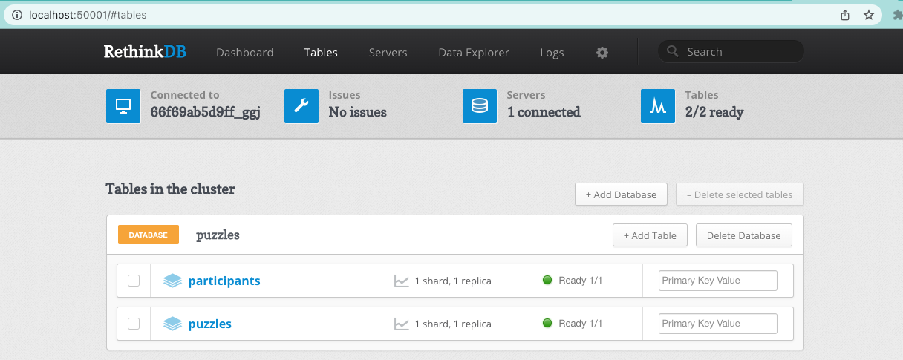

# #FlutterPuzzleHack Entry

This project is a flutter puzzle hack entry.

In my entry users can play together (or against one another ( •̀ᴗ•́ ) ) to complete the slide puzzle.

While playing you can see the other puzzle players interacting with te puzzle (with their custom pointers).

The puzzle in this project is generated on the (dart) server and send to clients via a gRPC server. A (dart) background worker collects all votes during a time window (3 seconds) and moves the tile that has the most votes.

# Play it!

## Web 🌐
Go to the deployed web page and play with everyone!

Link: https://app.nicepants.dev.

## Android 🤖
Join the Firebase test distribution via this invite link and Play along.

Join here => https://appdistribution.firebase.dev/i/ab7b670ebf749413

## iOS 🍏
Join the Firebase test distribution via this invite link and Play along.

Join here => https://appdistribution.firebase.dev/i/ccb24b98ef9d8bd7

## Mac 🍎 /  Windows 🪟 / Linux 🐧
Clone the app locally and build the corresponding app while connecting to production. Could not get packages out due to time constraints

# How to setup locally

## Setup database

- Clone the repo
- Make sure you have `docker` and `docker-compose` installed (https://docs.docker.com/get-docker/)
- Navigate to the root of the project
- Build all containers `docker-compose build` and after that bring them all up `docker-compose up`
- Now all containers are made we can stop them with ctrl+c
- For local you only need the puzzle_db container. Bring it up with this command `docker start puzzle_db`.
- Navigate to http://localhost:50001
- Here you should see the RethinkDB management interface.
- We need to add the database and base tables
- Click on Tables => Add Database => Name: `puzzles`
- Click on Add table on database `puzzles` => Name: `puzzles`
- Click on Add table on database `puzzles` => Name: `participants`
- The database is now correctly configured and should look like this.

## Run the server and worker

You can run the server and worker via VSCode (see run configurations). If you want to run them via command line run these commands.

**Server**

This is the gRPC server that is used to communicate with the clients and the database.

- Start server: `cd server && dart bin/server.dart`

**Worker**

The background worker is responsible for moving the tiles. Its a simple dart script the schedules tasks.

- Start worker: `cd server && dart bin/worker.dart`

## Run the app

Run `./bin/setup` to run `flutter pub get` in all 3 subprojects (app, shared, server)

Use your favorite IDE to run the app, or use the `flutter run` command. You do need to specify the local env to make sure you dont connect to the live server (thats the default). You can do so with this argument `--dart-define env=local`

### Enable desktop builds

You may want to enable desktop builds with the `flutter config --enable-XXX-desktop` commands to enable linux / windows / macos.